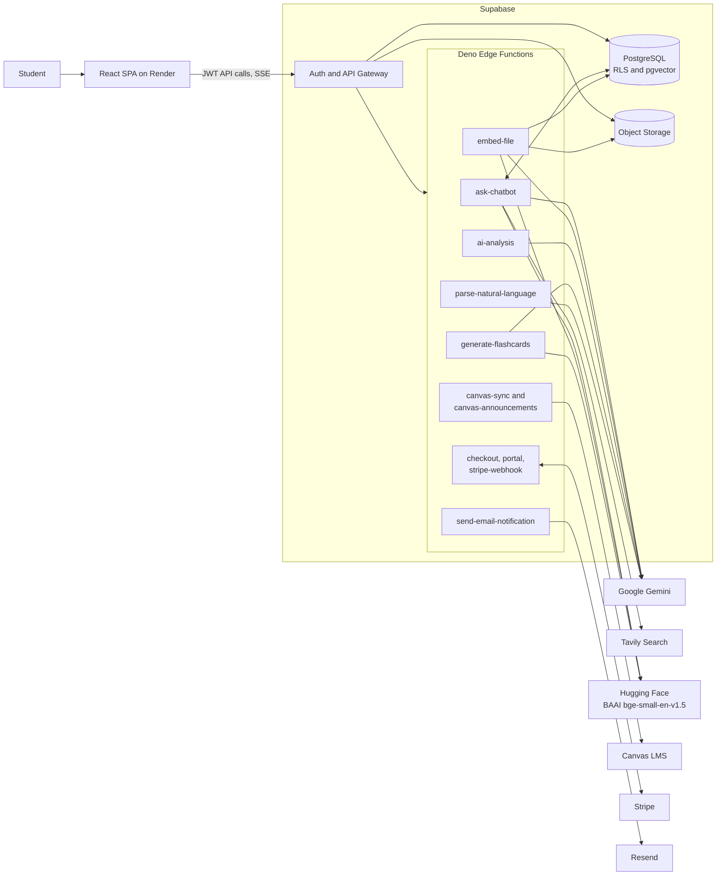
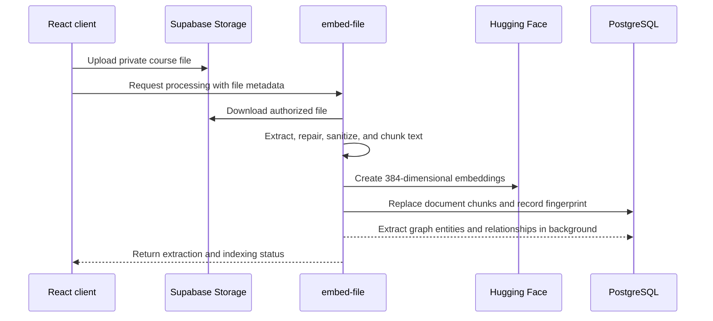
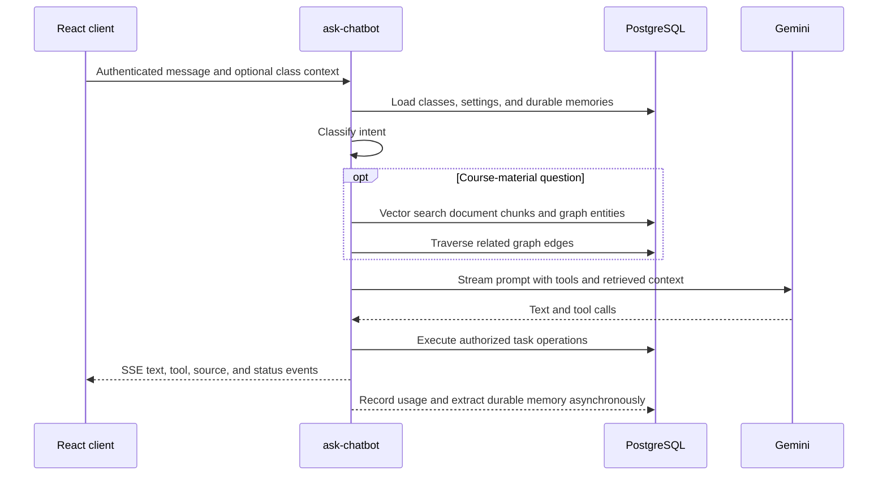

# ScheduleBud: AI-Powered Academic Scheduling for College Students

    

**Live Application:** [schedulebud.cc](https://schedulebud.cc/)

## Project Overview

ScheduleBud brings a student's tasks, classes, course files, Canvas assignments, announcements, and study materials into one application. It can extract deadlines from syllabi, answer questions over uploaded course content, manage tasks through natural language, generate and review flashcards, and synchronize subscription and notification state.

The product is a React single-page application backed by Supabase. PostgreSQL and Row-Level Security are the source of truth; Supabase Storage holds uploaded files; Deno Edge Functions isolate AI, Canvas, billing, and email integrations; Render serves the static frontend.

## Live Demo

[Watch the ScheduleBud demo](https://youtu.be/TEmODMrIAvg)

## Tech Stack

| Layer | Technology |
|---|---|
| Frontend | React 18, TypeScript, Tailwind CSS, Webpack |
| Backend | Supabase Auth, PostgreSQL, Storage, Realtime, Deno Edge Functions |
| AI | Gemini 2.5 Flash/Pro, Vercel AI SDK, Hugging Face Inference, pgvector |
| Integrations | Canvas LMS, Tavily, Stripe, Resend |
| Hosting | Render static sites, Supabase managed services |
| Quality | ESLint, TypeScript, Node regression tests, Playwright |

## System Design

The architecture follows five practical rules:

1. **Keep state in managed services.** PostgreSQL, Supabase Auth, and Storage own durable state; Edge Functions remain stateless.
2. **Enforce tenant isolation in the database.** User-owned tables use `user_id` and Row-Level Security instead of relying only on application filters.
3. **Keep secrets and privileged work server-side.** AI keys, Stripe secrets, the Supabase service role, Canvas proxying, and email delivery stay in Edge Functions.
4. **Degrade non-critical features safely.** Memory, GraphRAG, analytics, and usage logging cannot break the primary request path.
5. **Spend AI budget deliberately.** Model routing, local intent checks, embedding reuse, rate limits, feature caps, and token/cost logging reduce unnecessary calls.

### Runtime responsibilities

| Component | Responsibility |
|---|---|
| React SPA | UI, local interaction state, calendar/task presentation, upload orchestration, SSE consumption, and client-side normalization of Canvas events |
| Supabase Auth/API | Session management and authenticated access to database, storage, realtime changes, and Edge Functions |
| PostgreSQL | Tasks, classes, settings, documents, vectors, knowledge graph, assistant memories, flashcards/decks, subscriptions, notifications, rate limits, and usage records |
| Supabase Storage | Private course files and syllabi; file metadata remains in PostgreSQL |
| Edge Functions | Authenticated boundaries for AI processing, external APIs, billing, and email |
| Render | Builds and serves the production and development static sites after checks pass |

## Core Data Flows

### Course-file ingestion and retrieval

`embed-file` uses `unpdf` for PDF extraction, Gemini Flash as a repair/cleanup path, header-aware chunking with a token-size safety net, and `BAAI/bge-small-en-v1.5` for normalized embeddings. Content fingerprints allow an identical upload to reuse existing vectors. Reprocessing is idempotent: stale chunks and extraction rows are replaced rather than duplicated.

### Assistant request

The assistant routes requests among document search, task work, general knowledge, and conversation. Document questions combine pgvector chunk retrieval with one-hop GraphRAG context. Missing indexes can trigger a bounded self-healing re-index. The agent exposes task/class tools, task-type tools, web search, and clarification; destructive task deletion requires a second confirmed request.

Durable memory stores a bounded set of semantic facts and interaction preferences. A local self-disclosure check avoids running memory extraction on ordinary turns, dismissed memories are not resurrected, and stored memory is framed as untrusted context rather than system instructions.

### Canvas synchronization

`canvas-sync` authenticates the caller, validates the supplied HTTPS ICS URL, blocks private/reserved network targets, fetches with retry and timeout handling, and parses calendar events. The React client then resolves class names and task types, deduplicates by Canvas UID, and persists user-owned classes and tasks through Supabase.

`canvas-announcements` separately validates a public Canvas hostname and API token, fetches active courses and announcements, strips unsafe HTML, and returns normalized announcement data. Canvas API tokens are request-scoped and are not stored in the database.

### Syllabus extraction and flashcards

`ai-analysis` sends validated syllabus text to Gemini Pro for structured course metadata and task extraction. It includes balanced-JSON and regex recovery paths so a truncated model response can still return verified tasks instead of discarding the entire result.

`generate-flashcards` supports generation from uploaded course material, pasted text, and existing cards. It streams structured results, runs a quality-assurance pass, stores decks and cards under RLS, and maintains SM-2 review fields (`ease_factor`, interval, repetition count, and next review). Flashcard embeddings support similarity checks and retrieval.

### Billing and notifications

Checkout and billing-portal sessions are created server-side from trusted price configuration and authenticated users. `stripe-webhook` verifies the raw-body signature before synchronizing customer and subscription state to PostgreSQL. The frontend subscribes to subscription changes through Supabase Realtime.

`send-email-notification` verifies the requesting user, reloads task details from the database, respects notification settings, suppresses same-day duplicates, enforces daily and per-minute limits, escapes user content, sends through Resend, and records delivery metadata.

## Edge Function Inventory

| Function | Purpose |
|---|---|
| `ask-chatbot` | Streaming AI assistant, hybrid RAG, memory, web search, and task tools |
| `embed-file` | File extraction, cleanup, chunking, embeddings, fingerprint reuse, and graph extraction |
| `ai-analysis` | Structured syllabus and deadline extraction |
| `generate-flashcards` | Streaming card generation, improvement, QA, and embeddings |
| `parse-natural-language` | Converts quick-add text into a reviewable task draft |
| `canvas-sync` | Secure Canvas ICS fetch and parsing |
| `canvas-announcements` | Secure Canvas API announcement fetch |
| `create-checkout-session` | Stripe Checkout creation |
| `create-portal-session` | Stripe Billing Portal creation |
| `stripe-webhook` | Verified Stripe event processing and subscription synchronization |
| `send-email-notification` | Rate-limited task email delivery through Resend |

Shared modules centralize session validation, CORS, trusted origins, SSRF checks, request parsing, model names, embeddings, subscription lookup, rate limiting, security logs, observability, and AI usage accounting.

## Data and Security Model

- Supabase Auth issues the browser session; the frontend receives only the project URL and anonymous key.
- Edge Functions validate the bearer session before user-scoped work. The service-role key remains server-side.
- RLS protects user-owned rows including tasks, classes, files, documents, memories, flashcards, decks, settings, and usage data.
- Storage paths and file metadata are checked against the authenticated owner before processing.
- PostgreSQL-backed per-user and per-IP rate limits work across stateless Edge Function instances.
- Free-tier feature caps are enforced server-side with idempotent usage records and refund paths for failed AI work.
- AI calls record model, function, action, token counts, request IDs, and estimated cost without making telemetry a dependency of the user response.
- Canvas endpoints include SSRF defenses; Stripe webhooks use signature verification; redirect origins are allow-listed; rendered email content is escaped.

## Deployment

Render defines separate static services for `main` and `dev`. A deployment installs locked dependencies, applies Supabase migrations through the repository safety script, builds the React bundle, and publishes `frontend/build`. Production headers include CSP, HSTS, clickjacking protection, MIME sniffing protection, a strict referrer policy, and a restrictive permissions policy.

The repository's CI order is lint, TypeScript checking, regression tests, and a production build. Database migrations and Edge Function deployments use explicit development and production project references so the same source can be promoted without embedding environment credentials.

## Design Trade-offs

- The browser owns presentation and some normalization work; privileged network access and secrets stay at the edge.
- Retrieval and memory enrich an answer but fail open so an auxiliary subsystem cannot take down chat.
- PostgreSQL is used for vectors, graph data, limits, analytics, and application records to avoid operating additional stateful infrastructure.
- AI model identifiers are centralized and environment-overridable: free paths default to Gemini 2.5 Flash and premium reasoning paths to Gemini 2.5 Pro.
