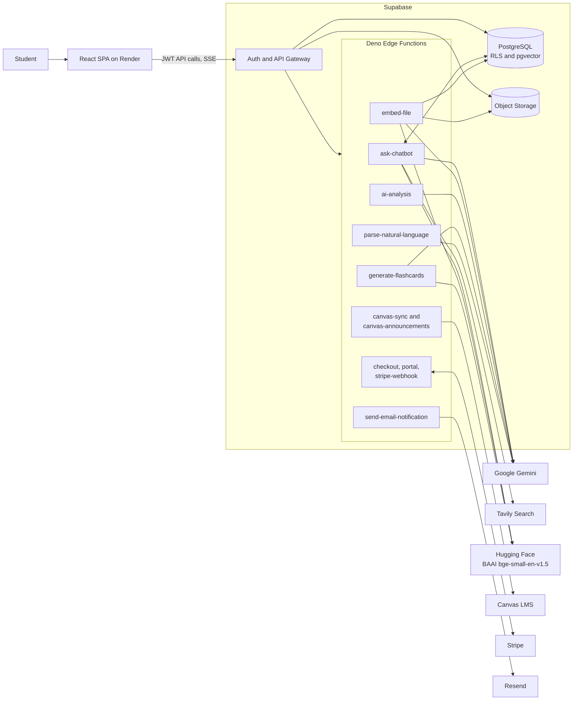
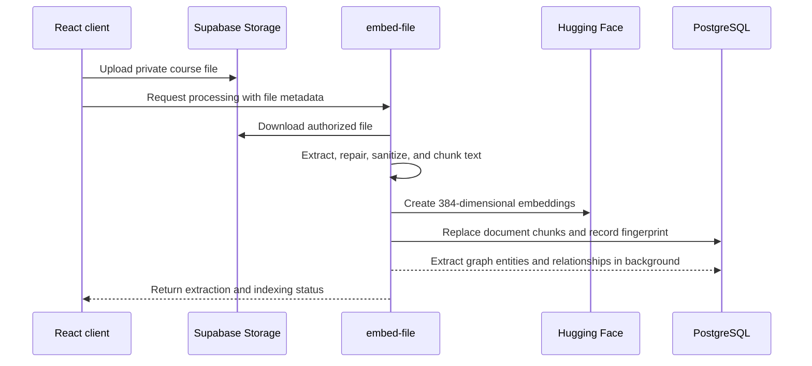
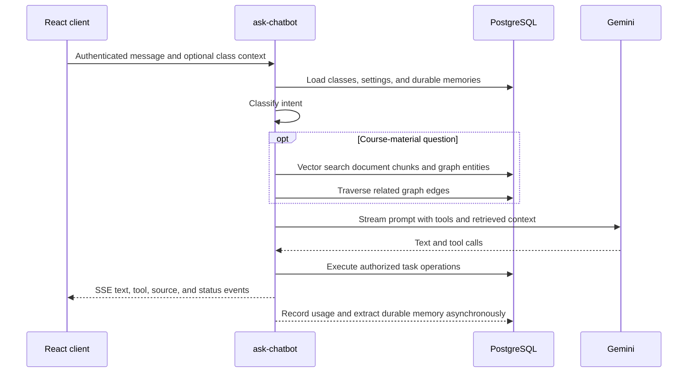

# ScheduleBud: An AI-Powered Academic Platform for College Students

    

**Live Application:** [schedulebud.cc](https://schedulebud.cc/)

## What ScheduleBud Does

College work tends to end up scattered across Canvas, syllabi, calendars, notes, and a handful of study apps. ScheduleBud pulls that work into one place. Students can sync Canvas assignments and announcements, upload course files, extract deadlines from a syllabus, ask questions about their material, manage tasks in plain English, and generate flashcards for review.

Under the hood, it is a React single-page application backed by Supabase. PostgreSQL is the source of truth, private files live in Supabase Storage, and Deno Edge Functions handle the work that should never happen in the browser: AI calls, Canvas requests, billing, and email. Render serves the frontend.

## Live Demo

[Watch the ScheduleBud demo](https://youtu.be/TEmODMrIAvg)

## Tech Stack

| Layer | Technology |
|---|---|
| Frontend | React 18, TypeScript, Tailwind CSS, Webpack |
| Backend | Supabase Auth, PostgreSQL, Storage, Realtime, Deno Edge Functions |
| AI | Gemini 2.5 Flash/Pro, Vercel AI SDK, Hugging Face Inference, pgvector |
| Integrations | Canvas LMS, Tavily, Stripe, Resend |
| Hosting | Render static sites, Supabase managed services |
| Quality | ESLint, TypeScript, Node regression tests, Playwright |

## How It Fits Together

The system is deliberately serverless. Supabase handles authentication, data, storage, and realtime updates, which leaves the application code focused on the parts that are specific to ScheduleBud.

There are a few boundaries that matter. Durable state stays in managed services rather than in Edge Function memory. Row-Level Security protects each student's data even if application code makes a bad query. Secrets and privileged API calls stay on the server. Optional features such as memory, GraphRAG, analytics, and usage logging are allowed to fail without taking down the main request. AI calls are routed, reused, limited, and measured because they are both the slowest and the most expensive part of the stack.

### Who owns what

| Component | Responsibility |
|---|---|
| React SPA | Renders the app, manages local interaction state, starts uploads, consumes streaming responses, and turns Canvas events into tasks and classes |
| Supabase Auth/API | Manages sessions and authenticated access to the database, storage, realtime updates, and Edge Functions |
| PostgreSQL | Stores tasks, classes, settings, documents, vectors, graph data, assistant memories, flashcards, subscriptions, notifications, limits, and usage records |
| Supabase Storage | Holds private course files and syllabi while PostgreSQL keeps their metadata |
| Edge Functions | Provide the authenticated server boundary for AI work, external APIs, billing, and email |
| Render | Builds and serves the production and development frontend sites after checks pass |

## What Happens Behind the Scenes

### Course-file ingestion and retrieval

When a student uploads a PDF, `embed-file` extracts the text with `unpdf`. If the result needs cleanup, Gemini Flash repairs it before it is split into sensible, header-aware chunks. Hugging Face's `BAAI/bge-small-en-v1.5` model turns those chunks into 384-dimensional embeddings for search.

The pipeline fingerprints each file, so an identical upload can reuse work that has already been done. Reprocessing replaces old chunks and extraction records instead of quietly creating duplicates.

### Assistant request

Not every message needs the full retrieval pipeline. The assistant first decides whether the student is asking about course material, managing a task, asking a general question, or simply continuing the conversation. Course questions search both document chunks and the small knowledge graph built during ingestion. If a file has not been indexed yet, the assistant can queue one repair attempt and continue gracefully if it does not work.

Gemini can also call tools to find classes, create or update tasks, manage task types, search the web, or ask the student to clarify an ambiguous request. Deleting tasks is the exception: it always requires a separate confirmation before anything is removed.

The assistant remembers a small number of useful facts and preferences across conversations. A quick local check skips memory extraction for ordinary messages, deleted memories stay deleted, and recalled information is treated as untrusted context rather than as instructions to the model.

### Canvas synchronization

Canvas is split into two paths. For assignments, `canvas-sync` validates the student's HTTPS calendar URL, blocks private and reserved network targets, fetches the ICS feed with retries and a timeout, and parses the events. The React client then matches class names and task types, removes duplicates by Canvas UID, and saves the result through Supabase.

Announcements come through `canvas-announcements`, which checks the Canvas hostname, uses the supplied API token to load active courses and announcements, strips unsafe HTML, and returns a clean response. The token is used for that request only and is never stored in the database.

### Syllabus extraction and flashcards

Syllabus parsing is separate from document search. `ai-analysis` sends validated text to Gemini Pro and asks for structured course details and deadlines. Model responses are not always perfect, so the parser can recover complete task objects from truncated JSON instead of throwing away an otherwise useful result.

Flashcards can be generated from uploaded material, pasted text, or an existing set of cards. Results stream back as they are created, pass through a quality check, and are saved into decks protected by RLS. Review scheduling uses the familiar SM-2 fields—ease, interval, repetition count, and next review—and embeddings help catch similar cards.

### Billing and notifications

Stripe Checkout and Billing Portal sessions are created on the server from trusted price configuration. Stripe remains the authority on payment events: the webhook verifies every signature before updating subscription state in PostgreSQL, and the frontend receives those changes through Supabase Realtime.

Email follows the same pattern. Before Resend receives anything, `send-email-notification` verifies the caller, reloads the task from the database, checks the student's preferences, prevents same-day duplicates, applies daily and per-minute limits, and escapes user-provided content. Successful deliveries are recorded for support and debugging.

## Edge Function Inventory

| Function | Purpose |
|---|---|
| `ask-chatbot` | Streaming AI assistant, hybrid RAG, memory, web search, and task tools |
| `embed-file` | File extraction, cleanup, chunking, embeddings, fingerprint reuse, and graph extraction |
| `ai-analysis` | Structured syllabus and deadline extraction |
| `generate-flashcards` | Streaming card generation, improvement, QA, and embeddings |
| `parse-natural-language` | Converts quick-add text into a reviewable task draft |
| `canvas-sync` | Secure Canvas ICS fetch and parsing |
| `canvas-announcements` | Secure Canvas API announcement fetch |
| `create-checkout-session` | Stripe Checkout creation |
| `create-portal-session` | Stripe Billing Portal creation |
| `stripe-webhook` | Verified Stripe event processing and subscription synchronization |
| `send-email-notification` | Rate-limited task email delivery through Resend |

The functions share the plumbing that should behave consistently everywhere: session checks, CORS, trusted origins, SSRF protection, request parsing, model selection, embeddings, subscription lookup, rate limiting, security logs, observability, and AI usage accounting.

## Security and Reliability

The browser only receives the Supabase project URL and anonymous key. Supabase Auth issues the session, every user-facing Edge Function validates it, and the service-role key never leaves the server. RLS protects user-owned tasks, classes, files, documents, memories, flashcards, decks, settings, and usage records. File processing also checks both the storage path and its database metadata against the authenticated owner.

Rate limits live in PostgreSQL, so they still work when requests land on different stateless function instances. Free-tier limits are enforced on the server with idempotent usage records, and failed AI jobs can return the allowance they reserved. AI telemetry records the model, operation, token counts, request ID, and estimated cost, but a logging failure never blocks the student's response.

The external integrations have their own guardrails: Canvas requests include SSRF protection, Stripe webhooks require a valid signature, billing redirects use an origin allow-list, and email templates escape user content.

## Deployment

Render hosts separate static sites for `main` and `dev`. A deployment installs the locked dependencies, applies Supabase migrations through the repository's safety script, builds the React app, and publishes `frontend/build`. The production site ships with CSP, HSTS, clickjacking protection, MIME-sniffing protection, a strict referrer policy, and a restrictive permissions policy.

CI runs linting, TypeScript checks, regression tests, and a production build. Database migrations and Edge Function deployments use explicit development and production project references, so the same code can move between environments without baking credentials into the repository.

## Why It Is Built This Way

ScheduleBud keeps presentation and lightweight normalization in the browser, while anything involving a secret or privileged network call stays at the edge. Retrieval and memory make the assistant more useful, but neither is important enough to take down chat when it fails.

PostgreSQL already sits at the center of the application, so it also holds vectors, graph data, rate limits, analytics, and product records. That keeps the operational footprint small and makes ownership rules easier to reason about. Model names live in one shared module and can be changed through the environment; today, the free paths use Gemini 2.5 Flash and premium reasoning uses Gemini 2.5 Pro.
